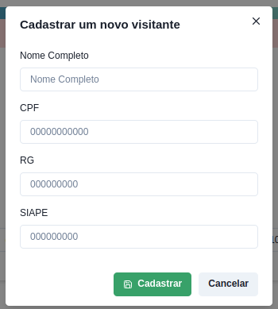

## Cadastro de nova ENTRADA/movimentação

1. Clique no botão **Adicionar Nova Entrada** (botão em preto).
2. Digite a placa do veículo.
3. Digite uma observação, se necessária.
4. Selecione o visitante.
5. Caso o visitante não esteja cadastrado, clique em **Visitante não cadastrado?** (botão em amarelo);

6. Um modal será aberto, exibindo um formulário para cadastrar um novo visitante.

7. Digite o nome completo e um dos documentos solicitados: CPF, RG ou SIAPE.
8. Clique em **Cadastrar** (botão em verde) para salvar o novo visitante no banco de dados.
9. Após cadastrar um novo visitante, o modal será fechado e você poderá selecioná-lo na lista dos visitantes já cadastrados.
 Caso uma movimentação tenha mais de um visitante, clique em **Adicionar visitante** e repita os passos 5 a 8.
10. Clique em **Registrar entrada** (botão em verde) para salvar a movimentação no banco de dados.

## Cadastro de SAÍDA em uma movimentação

1. Encotre a movimentação desejada;
2. Clique em **Registrar saída** (botão em vermelho);
3. Se necessário digitar alguma observação de saída, clique no ícone ao lado **Registrar entrada**, uma campo abaixo irá abrir para digitação.