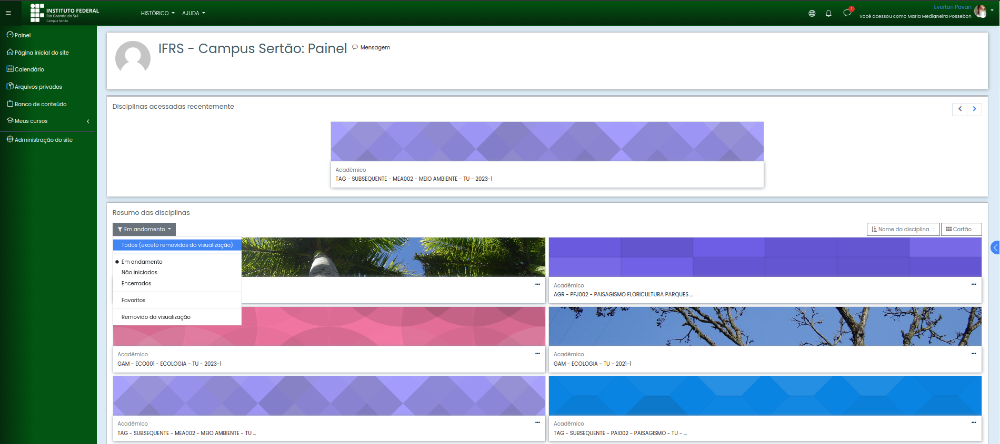

<!-- ## Manual do usuário - Moodle

Segue abaixo as soluções para alguns problemas/dificuldades/dúvidas encontrados no Moodle.

 -->

### **Problema: Algumas disciplinas não aparecem no Moodle:**

Isso pode ocorrer quando as datas de início e término das disciplinas foram configuradas de forma errada.   
Por exemplo, se a data de início for 01/01/2022 e a data de término for 31/12/2022, o Moodle entenderá que a disciplina não está em andamento e foi concluída.

### **Solução: Exibir todas as disciplinas**

1. Entre na página inicial do Moodle.
2. Clique no botão abaixo do texto "Resumo das disciplinas" (geralmente, por padrão, a opção "Em andamento" está selecionada).
3. Selecione a opção "TODOS" (exceto removidos da visualização).

A lista de disciplinas será atualizada com todas as disciplinas vinculadas ao seu usuário.

 

### **Solução: Ajustar datas de início e término da disciplina**

Para ajustar as datas de início e término das suas disciplinas, siga os passos abaixo:

1. Clique na disciplina que deseja editar.

2. Na página de visualização da disciplina, no canto superior direito, clique no ícone de engrenagem e selecione a opção "Editar as configurações".

3. Se for uma disciplina de 2023:  
3.1 No item "Data de início do curso", insira 01/03/202  
3.2 No item "Data de término do curso", marque o checkbox "Habilitar", insira 31/12/2023.

4. Se for uma disciplina anterior à 2023:  
4.1 No item "Data de início do curso", insira 01/03/2022  
4.2 No item "Data de término do curso", marque o checkbox "Habilitar", insira 31/12/2022.

5. Clique em "Salvar e mostrar" no botão azul bem abaixo.

Pronto! As configurações da disciplina foram atualizadas.
